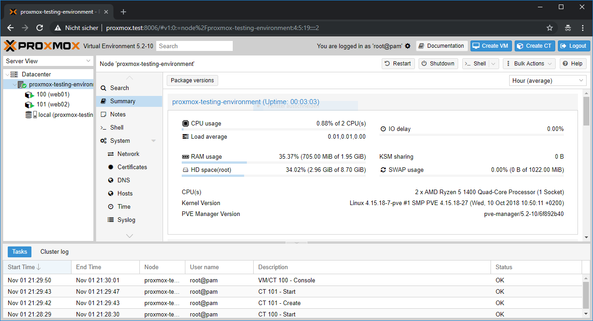

# proxmox-testing-environment

[Proxmox](https://www.proxmox.com/) testing environment in a Vagrantbox based on Debian and provisioned with Ansible.

## Requirements

- Virtualbox >= 5.2.8
- Vagrant >= 2.0.1
- Vagrant Plugins:
  - vagrant plugin install vagrant-hostmanager
  - vagrant plugin install vagrant-vbguest

## Getting started

1. git clone https://github.com/neikei/proxmox-testing-environment.git
2. cd proxmox-testing-environment
3. vagrant up
4. ... wait ...
5. Open Proxmox in your web browser: https://proxmox.test:8006

## Initial credentials

The initial credentials are required for the access to the Proxmox Web GUI and shown during the provisoning.

```bash
TASK [proxmox : Proxmox is ready to use] ***************************************
ok: [default] => {
    "msg": "URL=https://proxmox.test:8006 // User=root // Password=vagrant"
}

PLAY RECAP *********************************************************************
default                    : ok=22   changed=16   unreachable=0    failed=0
```

## Screenshot



## Feedback, Issues and Pull-Requests

Feel free to report issues, fork this project and submit pull requests.